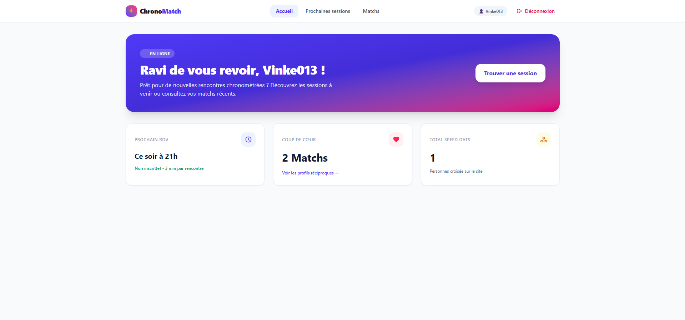
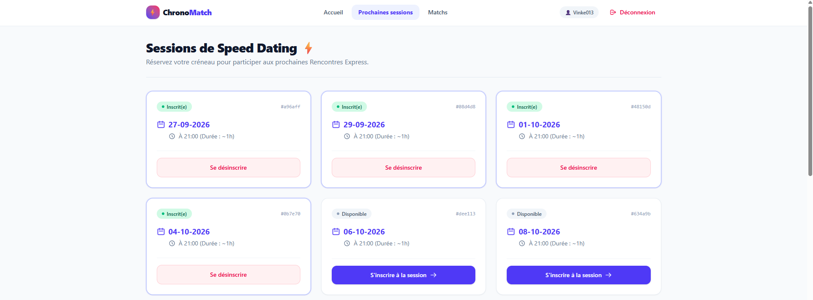
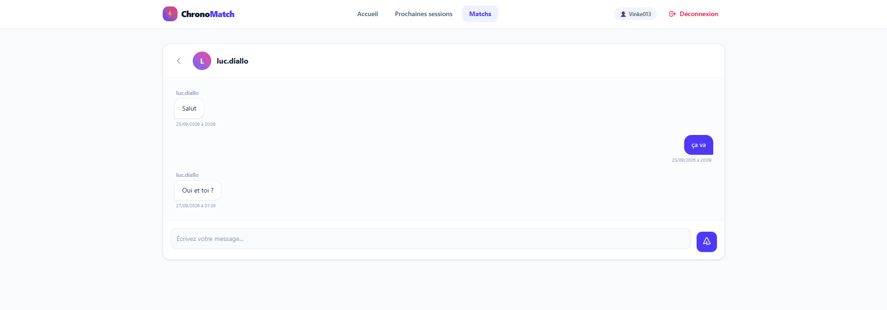

# 🚀 ChronoMatch — L'expérience du speed dating réinventée par la performance du temps réel.

ChronoMatch est une application web de speed dating par chat, conçue pour proposer une expérience de rencontre fluide, rapide et sécurisée.

Inspirée des rencontres éclair traditionnelles, la plateforme plonge deux utilisateurs compatibles dans une session de tchat éphémère d'une durée stricte de 180 secondes. Dès le compte à rebours écoulé, la discussion prend fin et chacun indique de manière confidentielle s'il souhaite poursuivre l'échange. La mise en relation définitive (Match) n'est dévoilée que si l'intérêt est mutuel.

---

## 📸 Aperçu de l'interface

| Authentification | Tableau de bord |
| :---: | :---: |
|  |  |

| Inscription aux Sessions | Tchat en Direct |
| :---: | :---: |
|  |  |

| Bilan de Session (Oui/Non) | Révélation du Match |
| :---: | :---: |
| .png) | .png) |

---

## 🛠️ Stack Technique

* **Back-End :** PHP 8.2+ (Architecture modulaire sans framework)
* **Base de données :** MySQL (PDO, requêtes préparées)
* **Temps réel & WebSockets :** Node.js (Gestion de la signalisation et des salons)
* **Authentification & Sécurité :** JWT (JSON Web Tokens), chiffrement AES pour la transmission d'IDs
* **Front-End :** HTML5 / JavaScript ES6+ / Tailwind CSS

---

## ✨ Fonctionnalités Principales

* 🔒 **Authentification & Sécurité :** Gestion des sessions utilisateurs, hachage des mots de passe et chiffrement des identifiants transités.
* 📅 **Réservation de créneaux :** Module de réservation et de désinscription aux sessions de speed dating.
* ⚡ **Salons éphémères de 180 secondes :** Synchronisation WebSockets du temps restant et fermeture automatique de la room.
* 🤝 **Matchmaking à double aveugle :** Choix confidentiel en fin de chrono et déblocage de la messagerie en cas de coup de cœur partagé.

---

## 🚀 Installation

### Prérequis
* PHP 8.2+
* Node.js 18+ / npm
* MySQL
* Git
* Composer

### Lancement rapide

# 1. Cloner le projet
```bash
git clone https://github.com/KevinGL/Chrono-Match.git
cd Chrono-Match
```

# 2. Installer les dépendances PHP (Autoloader PSR-4 + FakerPHP)
```bash
composer install
```

# 3. Configurer les variables d'environnement (.env à la racine)
```bash
cat <<EOT> .env
DATABASE_URL=mysql:host=localhost;dbname=chronomatch
JWT_KEY=votre_cle_jwt_secrete_tres_longue
SECRET_KEY=votre_cle_secrete_aes
IV_KEY=1234567890123456
EOT
```

# 4. Synchroniser la configuration du serveur WebSocket (ws/.env)
```bash
cd ws
cat <<EOT> .env
JWT_KEY=votre_cle_jwt_secrete_tres_longue
SECRET_KEY=votre_cle_secrete_aes
IV_KEY=1234567890123456
EOT
```

# 5. Initialiser la base de données
```bash
php Create_database.php --host=127.0.0.1 --port=3306 --username=root --password="" --dbname=chronomatch
```

# 6. Générer le jeu de données de test (fixtures)
```bash
php Fixtures.php --nb=10 --host=127.0.0.1 --port=3306 --username=root --password="" --dbname=chronomatch
```

# 7. Démarrer les serveurs
## Terminal 1 : Serveur Web PHP
```bash
php -S localhost:8000
```

## Terminal 2 : Serveur WebSockets
```bash
cd ws
npm install
npm run start
```

### 🧪 Tester la démo

Ouvrez votre navigateur sur `http://localhost:8000`. Connectez-vous avec n'importe quel email généré par les fixtures (mot de passe : `1234`). Pour simuler une rencontre en direct, ouvrez une seconde fenêtre en **navigation privée** avec un autre compte.
